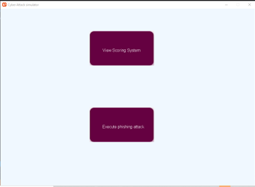

# Network security simulation
## Project background

This project idea was initially conceived to be my computer science A Level NEA however, with covid this aspect of the A Level was removed. Instead of abandoning the project I decided to complete it in my own time.

This is the first extended coding project I ever completed and whilst basic in the resulting interface, this was the basis of my experience in GUI creation and production of larger systems of code and thus is a key point of reference in my coding progress

## Project aim

The aim of this project is to create a visual simulation of a network, its devices and users, which a theoretical cyber attack could then be run against. Using a defined scoring criteria, the system would then work out how each device would be impacted were the attack to occur in real life and thus how vulnerable the network is.

Restricted by my own coding ability as well as knowledge of exacerbating features in the event of a cyber attack, the scope of the project was quickly reduced and overall, instead of simulating multiple cyber attacks, the simulation produced focuses solely on phishing attacks.

## Content overview:
|Script | function | link |
|-------|----------|------|
|Game1| This script calls all others, trigger set up of the GUI, creation of nodes, allocation of details to said nodes, etc |[Game1 script](./code/Game1.cs)|
|Nodes| This script contains all of the functions required to create nodes, allocate them data and draw them. These function are what Game1.cs calls.|[Nodes script](./code/Nodes.cs)|
|Program| This script calls 'Game1.cs' starting the simulation|[Program script](./code/Program.cs)|

## Resources used:
This project was implemented in C# using monogame.

## System design:
#### Menu:

#### Examining nodes

#### Result of clicking 'execute phishing attack' button

#### Scoring system screen
The below screen could be seen if the 'view scoring system' button was selected

## Improvements:
Being my first foray into GUI creation, etc this project leaves a lot to be desired. Were I to re-implement this project now, I would make the following changes:
- Implement the system in python -> I feel using C# for this project hindered the potential of the GUI created as I was restricted to using monogame which I was not overly familiar with. Implementing with python and thus ability to use libraries such as tkinter, etc, which I have experience with, would allow me to create a more polished product
- Add ability to simulate more attacks then just 'phishing' to better fit the initial idea.
- Add ability for user to specify the network simulated allowing them to test their own network configuration.
